# 
 <strong>VJTI-RAILWAY-CONCESSION<strong>

## <strong> **⏬ Installation**
---

Hey Buddy, Welcome to the 
[Railway Concession App](https://github.com/aniketpanchal52648/VJTI-Railway-Concession)

To run this app on your local machine, 

1. First things first, Fork the [Repository](https://github.com/aniketpanchal52648/VJTI-Railway-Concession)

2. Clone this repository into your folder of choice

`git clone https://github.com/aniketpanchal52648/VJTI-Railway-Concession.git`

3. Install Node Packages

`npm install`

4. Run the App from your ROOT Directory

`node app.js`

----

## <strong> **🚆Web App Details**

Login Page

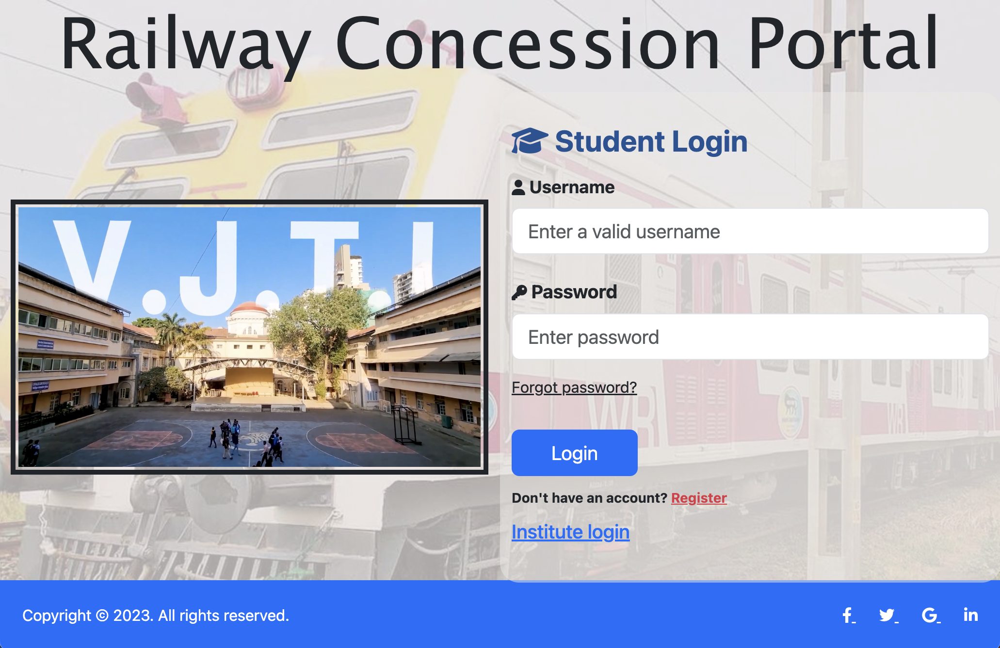

Signup Page

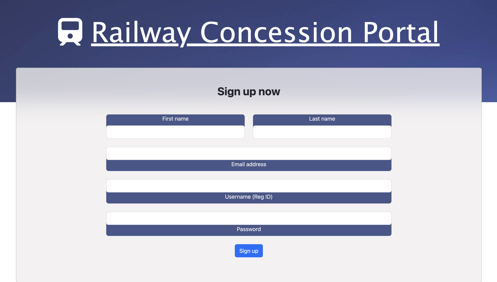

Institute Login

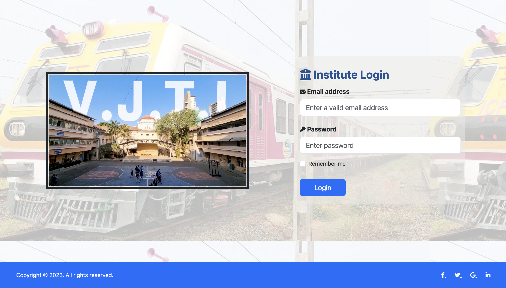

Institute Home Page

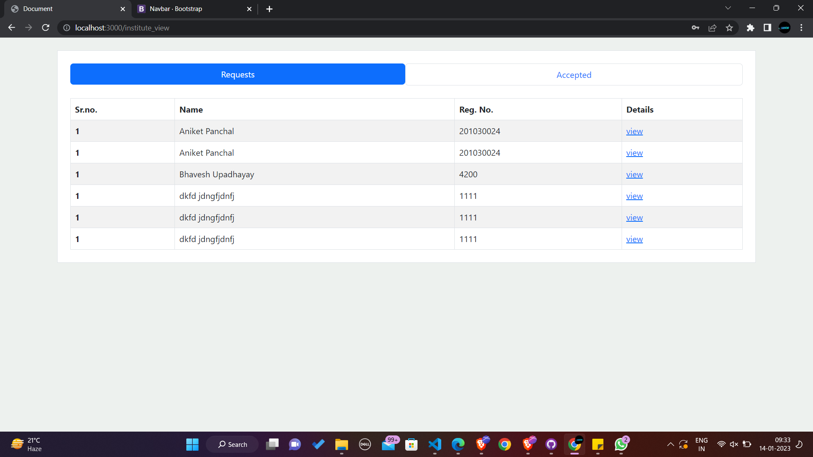

Institute Accepted Page

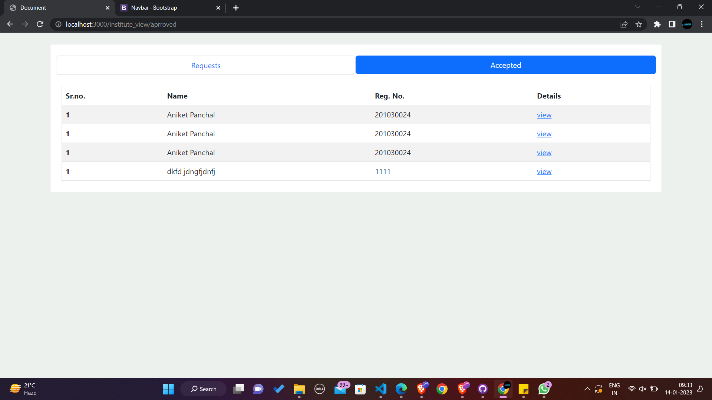

Application Page (Student)

Document Page (Student)

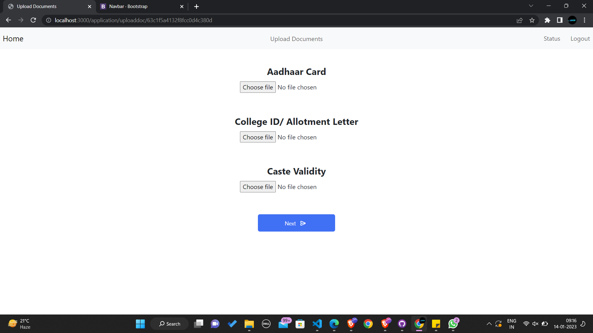

Concession Details Page (Student)

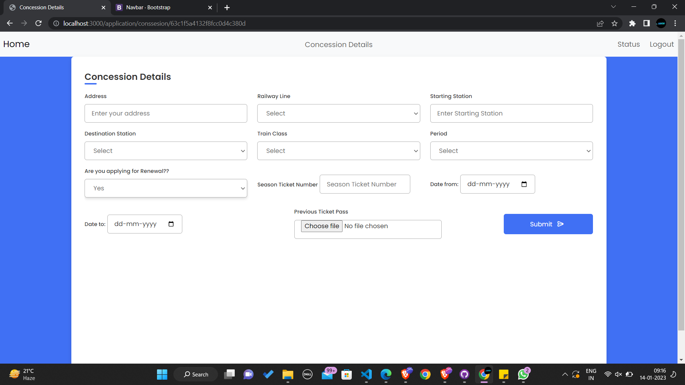

--- 

## <strong> **📃 View Pages of Admin**

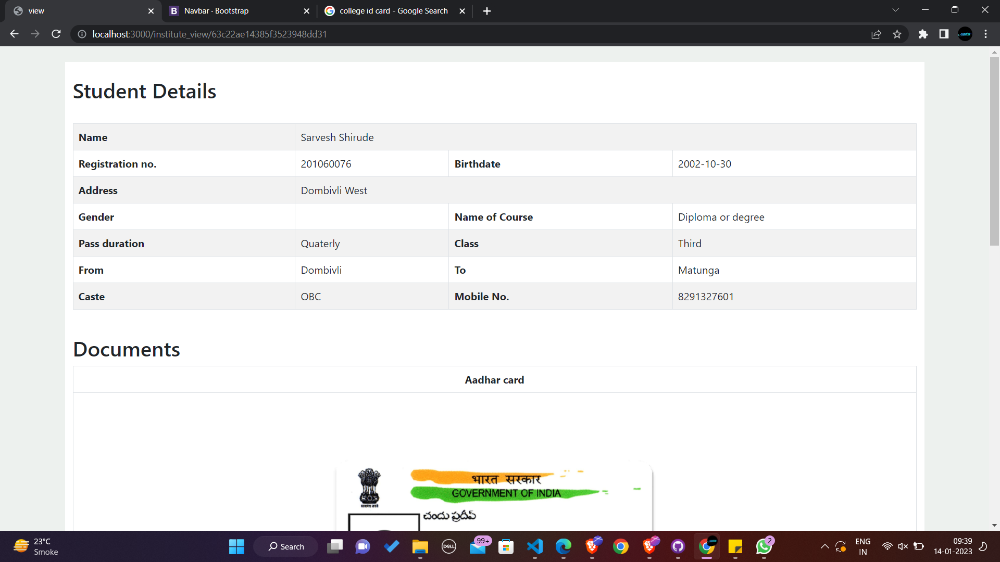

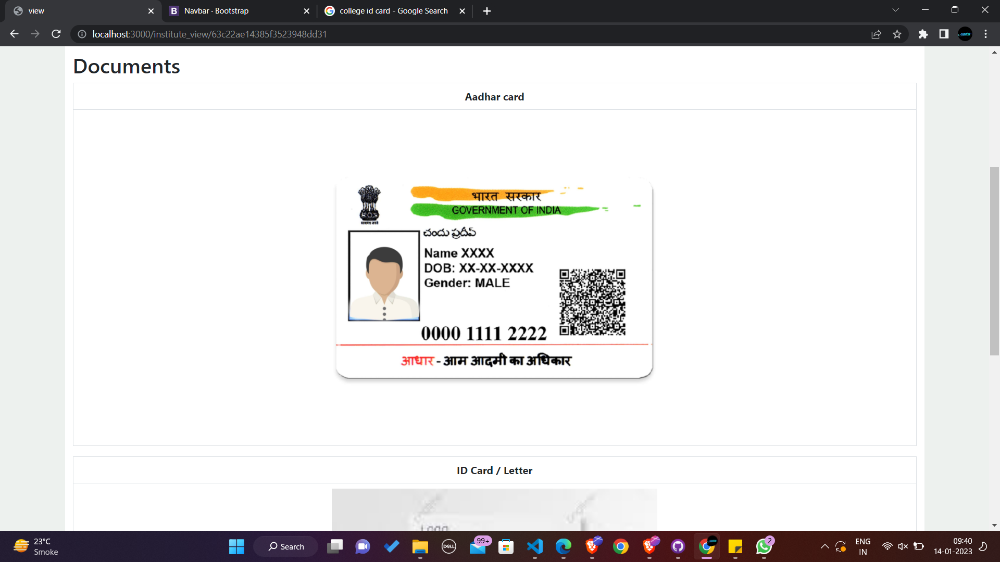

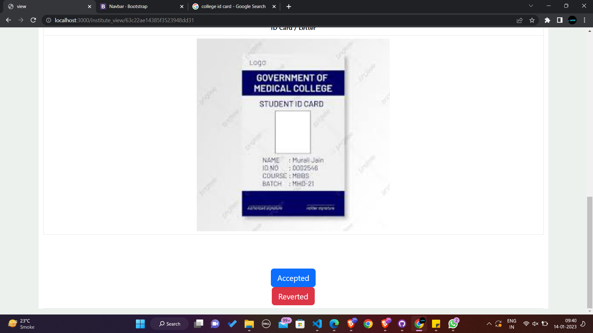

---

## <strong> **📧 Gmail Notifications Using NodeMailer**

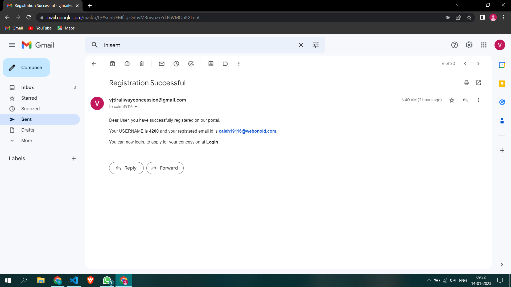

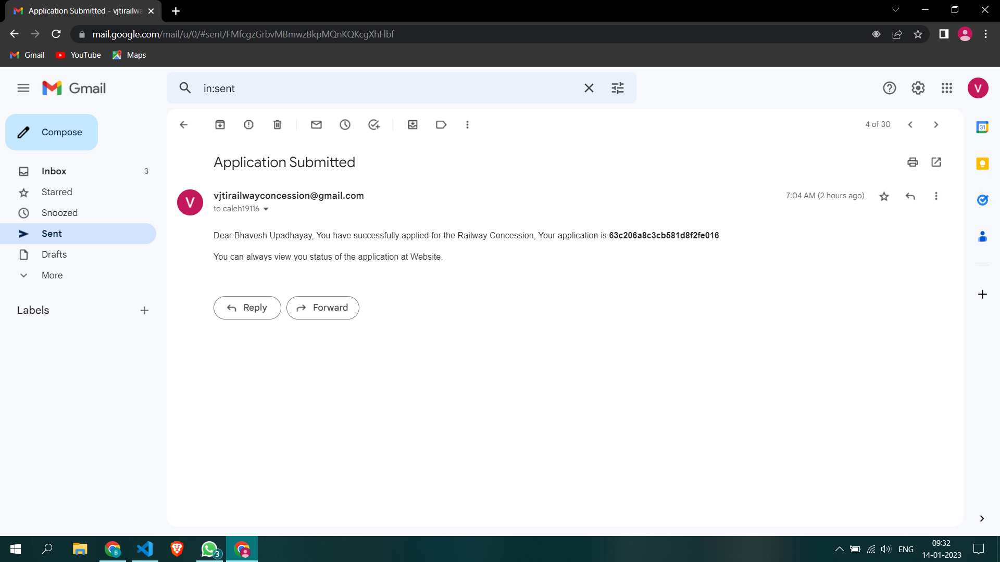

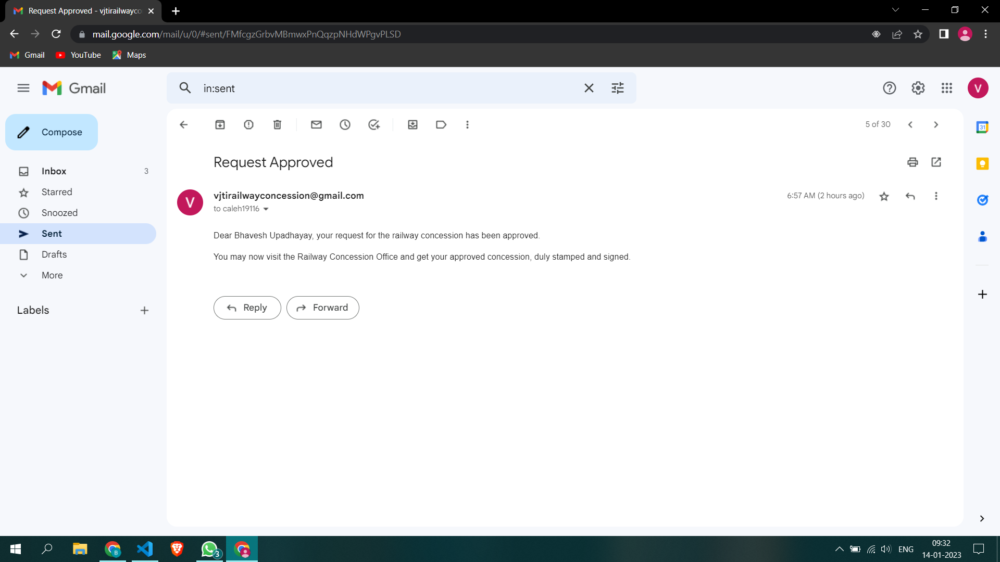

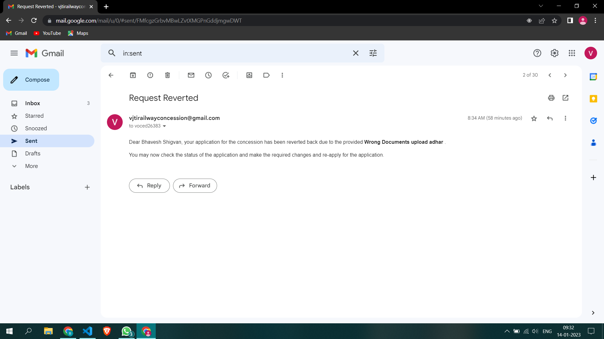

---
## <strong> **⚙ Built with**

---

**We really enjoyed the Centenary Hackathon 2023 organised by GDSC and COC, hope to see more events in the future, and eager to participate in it.**

